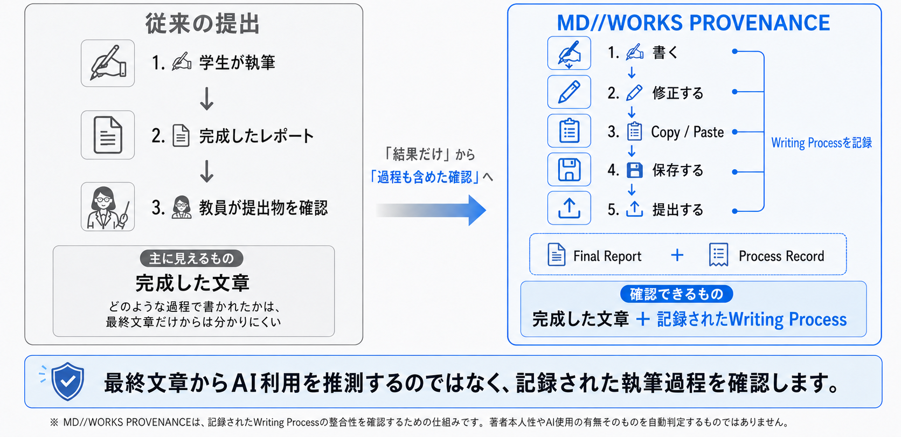
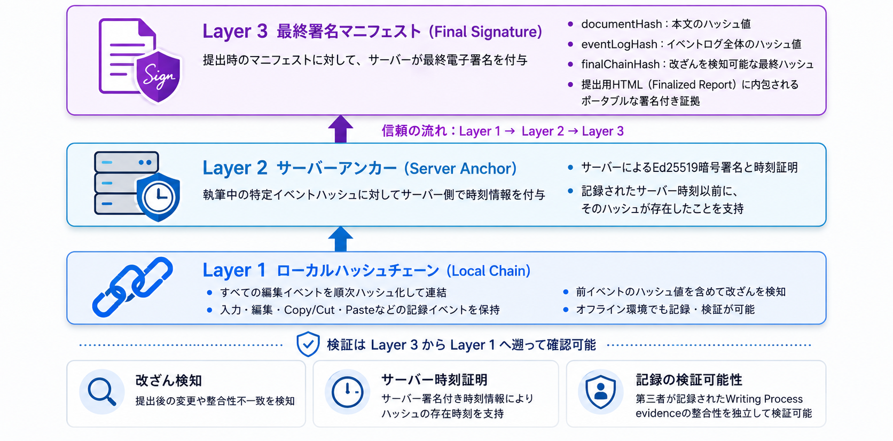

# MD//WORKS PROVENANCE
**ドキュメント:** [🇯🇵 日本語](README-ja.md) | [🇺🇸 English](README.md)  <br>

**自分のWriting Processを、自分で保持し、必要なときに第三者へ検証可能な記録として示せる。監視ではなく、透明性のためのMarkdownエディタ。**

[](./LICENSE)


> **通常版MD//WORKSは別プロジェクトとしてMIT、MD//WORKS PROVENANCEのコードは特記がない限りAGPL-3.0-onlyです。**  

生成AI、コピペ、Wordからの移行が当たり前になった今、最終文章だけを見て「誰が、どう書いたか」を推測することは難しくなっています。 MD//WORKS PROVENANCEは、AIらしさを判定するのではなく、 **文章がどのように編集されたかという執筆過程そのものを記録し、その記録が後から変更されていないかを検証できるようにするツールです。** 

<br>

> ### 💡 1分でわかる MD//WORKS PROVENANCE
>
> **何をするツール？**  
> 「AIが書いたか」を自動判定するのではなく、文章がどのように編集されたかという **Writing Process（執筆過程）** を記録するMarkdownエディタです。
>
> **何が残る？**  
> - 直接編集、Pasteの来歴、執筆Session、操作が行われていた時間などを自己完結型のHTML Reportに保存します。
> - 提出時にはFinal Signatureを付与し、後から署名対象の記録との不一致を検出できるようにします。
>
> **誰が判断する？**  
> AI利用、著者性、剽窃、不正を自動判定しません。評価者・教員・指導者等が、記録されたEvidenceを他の情報と合わせて確認するための材料を提供します。執筆者自身が、書いたプロセスを第三者に説明する材料としても使えます。

[ すぐに試してみる ](https://hkjpn.github.io/MD-WORKS-PROVENANCE/) |  [改ざんはどう見えるか？](https://github.com/HKJPN/MD-WORKS-PROVENANCE/blob/main/samples/README.md)  |  [マニュアルを読む](./Manual-ja.md) | [学生向けFAQ](./FAQ-ja.md) | 

---

## 👨‍🎓 執筆者・学生の皆様へ

普段どおり文章を書き、**Save Report**で執筆記録を含むHTML Reportを保存します。同じReport内でのCopy / Cut → Pasteは照合され **Verified Internal** として記録され、同じReport内と確認できなかったPasteは **Unverified** として記録されます。

ペーストの**Unverified**　はもちろん
> **Unverified ≠ 外部由来 ≠ AI ≠ 剽窃 ≠ 不正**

ですが、外部からのペースト割合は一定割合以下に抑え、MD//WORKS PROVENANCE内で記述し編集することが推奨されます。もし外部からのペーストの割合が多い場合は [この2番目のサンプルファイルのように](https://github.com/HKJPN/MD-WORKS-PROVENANCE/blob/main/samples/README.md) 、評価者からは見えるようになります。

Experimental機能として、Direct Edit、削除、IME Composition、
Typing Chunk、Pause等のInput Process Metricsも記録されます。これは、執筆者独特のタイピングを記録しAIや自動入力ソフトと区別するためです。

提出時には「ファイル→レポートを提出」からFinal Signatureを付与したFinalized Reportを作成できます。もし、執筆過程や最終文書を1文字でも改ざんすると、[この3番目のサンプルファイル](https://github.com/HKJPN/MD-WORKS-PROVENANCE/blob/main/samples/README.md)のように、評価者からは見えるようになります。

こうした機能で、あなたのWriting Processを「監視する」のではなく、**「必要なときに、自分の執筆過程を説明できる形で残す**」ことができきます。

> 
---

## 👨‍🏫 評価者・先生方へ

提出されたReportの検証は、**Reportを外部の検証サービスへアップロードすることなく、ブラウザ内でローカルに実行できます。**

**1件を詳しく確認する場合**  
→ **Report Verifier**

**授業などで多数のReportを一覧確認する場合**  
→ **Overview Verifier**

Verifierでは、Document Hash、Event Log、Event Chain、Final Signature、Paste Provenance、Writing Timeline、Input Process Metrics等を確認できます。

これらが何を意味し、不正や改ざんをどのように評価すべきかは、[３つのサンプルファイル例](https://github.com/HKJPN/MD-WORKS-PROVENANCE/blob/main/samples/README.md)をご覧ください。

現β版ではReview Priorityの自動判定は有効化されておらず、通常 **Not assessed** と表示されます。

---

## ⚙️ コアアイデア：AI検出器ではなく、過程の検証器

多くのツールが最終提出物を主な対象とするのに対し、MD//WORKS PROVENANCEは、

> **どのようなWriting Processが記録され、
> その記録が現在も保存・署名されたEvidenceと整合しているか？**

を確認することを目的としています。最終文章から「AIか人間か」を推測するのではなく、**観測できた執筆過程を残し、その記録の整合性を後から検証する。** これがMD//WORKS PROVENANCEの基本的な考え方です。


---

## 他のツールと何が違うのか？ - AI検出器ではなく、過程の検証器

多くのツールが「最終提出物」を主に判定するのに対し、MD//WORKS PROVENANCEは、**記録された執筆過程と、その記録の整合性**を検証対象にします。

| アプローチ | 主な対象 | MD//WORKS PROVENANCEが追加するもの |
| :--- | :--- | :--- |
| 類似度チェック | 最終文章と既存資料の類似 | 記録されたWriting Process |
| AI分類 | 最終文章の統計的特徴 | AI確率ではなくprocess PROVENANCE |
| クラウド編集履歴 | 特定サービス内の編集履歴 | 提出HTML内に保持される可搬な証拠 |
| LMS提出 | 本人・授業・ファイル収集の運用 | process recordの暗号学的整合性 |
| **MD//WORKS PROVENANCE** | **記録されたWriting Process** | **単一または複数ReportのPROVENANCE・hash chain・署名検証** |

これらは代替関係とは限らず、目的に応じて補完的に利用できます。

---

## Input Process Metrics - 入力過程の観測をさらに詳しく

> **Experimental**
>
> Input Process Metricsは、Writing Processのうち、ブラウザが観測できる入力・削除・IME・入力中断などを、より詳しく記録するための機能です。
>
> **AI利用を自動判定する機能ではありません。**

Pasteを使用せず、文章を1文字ずつEditorへ入力するような自動操作も可能になっています。

そのためMD//WORKS PROVENANCEでは、従来のPaste PROVENANCEに加えて、**入力そのものの過程を軽量な集計情報として記録**できるようにしています。

### 記録する主な情報

- **Direct Edit**  
  Editor上で直接追加・削除された文字量

- **Deletion Operations**  
  文字除去を伴う直接編集の回数

- **IME Composition**  
  ブラウザが観測したIME compositionの回数、確定文字量、計測可能なcomposition時間

- **Typing Chunk**  
  連続したDirect Editを一定の単位にまとめた記録

- **Pause**  
  一定時間以上、対象となる入力Activityが観測されなかった区間

- **Capture Status / Issue Codes**  
  入力情報を十分に観測できなかった場合の状態や、その理由を示す技術情報

Input Process Metricsでは、**1キーごとの入力時刻やIME変換途中の文字列は保存しません。**

### Chunk / Pauseの基本ルール

- **2秒以上の無入力**を、Chunk境界およびPause判定の基準として使用
- **5秒**は長時間連続入力時の安全なflush上限であり、Pauseではありません
- **60秒以上のPause**は `long pause` として分類
- 取得できない値は推測せず、`null` / `degraded` / `unavailable` 等として扱う

Input Process Metricsは、通常のWriting Process Eventと同様にReportへ記録されます。

`event.meta.inputProcess`に保存された集計情報もHash Chainの対象となるため、記録後にEvent内容が変更された場合はVerifierで整合性を検証できます。

<br>

### Verifierで確認できること

Report Verifier / Overview VerifierのTechnical Viewでは、Event LogからInput Process Metricsを再集計し、たとえば次の情報を確認できます。

- Direct Edit
- Deletion Operations
- IME Composition
- Typing Chunk
- Pause / Long Pause
- Capture Status
- Issue Codes
- Input Process Availability
- Semantic Validation
- Summary consistency

暗号学的な **Integrity** と、Input Processをどの程度観測できたかという **Availability / Capture Status** は別々に扱います。

たとえば、

```text
Integrity: Verified
Input Process: Partial
````

というReportもあり得ます。

これは矛盾ではありません。

「記録されたEvent Logは改ざんされていないが、Input Process Metricsの一部を取得できなかった」ことを意味します。

### 重要な制限

Input Process Metricsは、**Editorが観測した編集過程を記録する仕組み**です。

次のことを証明・自動判定するものではありません。

* 人間本人が執筆したこと
* AIを利用していないこと
* 自動操作が行われていないこと
* 不正行為が行われたこと
* Pauseが「考えていた時間」であること
* 削除操作が「ミス」であること

Hash Chainや署名が検証するのは、**記録された内容の整合性**です。

記録された入力主体そのものを認証するものではありません。

Input Process Metricsは現在 **Experimental** としてTechnical Viewで確認できます。

Teacher Viewでは、これらの値から `Human` / `AI` / `Suspicious` 等の自動判定やスコアリングを行いません。

> 詳細な記録規則、Fallback、Semantic Validation、Acceptance Testについては
> [Input Process Metrics Specification](./Input_Process_Metrics_v2.1.2.md)
> を参照してください。

---

## 主な機能

### Editor（学生向け）

* **Writing Record**
  `Active 24m | Unverified 22% | Anchors: 14` を常時表示。クリックで詳細パネルを確認できます

* **Paste PROVENANCE**
  同一Report内のCopy/Cutに `transferId / sourceHash` で照合。一致すれば `Verified Internal`、しなければ `Unverified`

  そして重要：

  `Unverified ≠ 不正 ≠ AI ≠ 剽窃`

* **Input Process Metrics（Experimental）**
  Direct Edit、削除操作、IME composition、Typing Chunk、Pause等を軽量な集計情報として記録。1キーごとの入力時刻やIME未確定文字列は保存しません

* **Server Anchor & Final Signature**
  提出時にEd25519署名を付与。SHA-256はハッシュ、Ed25519は署名と役割を分離しています

* **学術特化**
  ローカル画像のBase64埋め込み禁止、Word (.docx) はカーソル位置へ挿入してUnverified記録、Emergency Recoveryは一時的なテキスト救済のみ

### Verifier（個人・教員・第三者向け）

* **Report Verifier**
  1つのReportを詳細に検証。学生、研究者、著者などが、自分のWriting Processを第三者へ説明・提示したい場合にも利用できます

* **Overview Verifier**
  複数HTMLをドラッグ＆ドロップで一括読込。授業や大学等でActive time、Non-internal paste share、Integrity、Signature、Review等を一覧化

* **Teacher View**
  Writing Timelineで執筆分布を可視化

* **Technical View**
  Document Hash / Event Log Hash / Final Chain Hashを独立再計算。Input Process MetricsではDirect Edit / IME / Pause / Capture Status / Semantic Validation等を表示し、Event Logから再集計します

  Paste量やInput Process Metricsの値が大きいという理由だけでWarning色を付けたり、Human / AI判定を行ったりしません。

  Integrityに関するWarningは、`Integrity mismatch / Invalid Signature / Hash Chain failure` 等の技術的な検証失敗に使用します。

### 使い分け

* 1つのReportを本人・指導者・共同研究者・編集者・依頼者等が確認する
  → **Report Verifier**

* 授業等で多数のReportをまとめて確認する
  → **Overview Verifier**

Report VerifierはOverview Verifierの「簡易版」という位置づけではなく、**単一Reportを持ち運び、第三者へ説明するためのシンプルな検証UI**です。

---

## 表示言語

Editor / Report Verifier / Overview VerifierのUIは、ブラウザの優先言語に応じて日本語または英語で自動表示されます。

現β版にはアプリ内の手動言語切替はありません。

表示言語はUIのみの違いであり、ReportのEvidence、Hash、Signature、Integrity判定、ソート順の意味、検証結果には影響しません。

---

## 使い方

インストール不要。HTMLファイルをブラウザで開くだけです。

**β版推奨環境: Windows + Chrome / Edge**

```bash
# 1. Editorを起動
academic-editor.html をブラウザで開く

# 2. 執筆 & 保存
Ctrl+S で Save Report
(HTMLコンテナで保存。Markdown .mdではありません)

# 3. 提出
Submitボタン
→ Ready to Submitで最終確認
→ Sign & Finalize
→ Finalized Report（署名付きHTML）をLMSへ提出

# 4A. 単一Reportを検証
report-verifier.html にFinalized Reportを読み込む

# 4B. 授業等で複数Reportを検証
overview-verifier.html に提出HTMLをまとめてドラッグ＆ドロップ
```

Active timeはEditorが記録したinteraction-active timeであり、思考・調査・読書・学習に費やした総時間を証明するものではありません。

Input Process MetricsのPauseについても同様に、思考時間や読書時間を意味するものではありません。

MD//WORKS PROVENANCEは **tamper-evident（改変を検知可能）であり、tamper-proof（変更不能）ではありません。**

Print/PDFは閲覧・校正には利用できますが、検証可能なAcademic Report HTMLと同じ提出形式ではありません。

---

## 詳細比較表 - 評価担当者向け

<details>
<summary>クリックで詳細な機能比較表を展開</summary>

| 項目                | MD//WORKS PROVENANCE                                                                      | 類似度チェック      | AI分類         | クラウド編集履歴              |
| :---------------- | :---------------------------------------------------------------------------------------- | :----------- | :----------- | :-------------------- |
| **目的**            | 執筆過程の透明化と記録の検証                                                                            | 既存資料との類似確認   | 最終文章の統計的分類   | サービス内の編集履歴を可視化        |
| **主な検証対象**        | 記録されたWriting Processとその整合性                                                                | 最終文章と既存資料    | 最終文章の特徴      | サービス内に保存された編集履歴       |
| **Unverifiedの定義** | 同一Report内の先行Copy/Cutと照合できなかったPaste。`Unverified ≠ 不正 ≠ AI ≠ 剽窃`                            | 類似度等を表示      | AIらしさ等を表示    | 通常は該当概念なし             |
| **Pasteの来歴**      | `transferId / sourceHash / pastedHash / sourceEventId` 等を利用して同一Report内のCopy/Cutと照合        | 通常は対象外       | 通常は対象外       | サービスにより異なる            |
| **入力過程**          | Direct Edit / IME Composition / Typing Chunk / Pause等をExperimentalに記録                     | 通常は対象外       | 通常は対象外       | サービスごとの編集履歴に依存        |
| **入力過程の判定**       | Human / AI / Suspicious等を自動判定しない                                                          | 主目的ではない      | AI分類が主目的     | 主目的ではない               |
| **整合性確認**         | Document Hash / Event Log Hash / Final Chain Hashを独立再計算し、Server AnchorとFinal Signatureを検証 | 主目的ではない      | 主目的ではない      | サービス側の履歴に依存           |
| **可搬性**           | Working / Finalized Report HTML内にWriting Processを保持                                       | サービスごとに異なる   | サービスごとに異なる   | 特定サービス内に依存する場合がある     |
| **プライバシー**        | ReportにIPアドレス、raw User-Agent、1キーごとの入力時刻列、IME未確定文字列等を意図的に保存しない                             | 各サービスの運用に依存  | 各サービスの運用に依存  | 各サービスの運用に依存           |
| **オフライン**         | ローカルSave等はオフライン可。新規Server AnchorとSubmitはオンライン                                             | 各サービスに依存     | 各サービスに依存     | 各サービスに依存              |
| **AIへの立場**        | AIを検出・判定しない。利用可否は授業等の方針に委ねる                                                               | 主目的ではない      | AIらしさを分類     | 主目的ではない               |
| **ライセンス**         | **AGPL-3.0-only**。PROVENANCE・検証ロジックを公開されたソースで確認可能。代替Institutional Licenseが提供される場合がある      | 各サービスの条件に依存  | 各サービスの条件に依存  | 各サービスの条件に依存           |
| **主な境界**          | Editorで観測したprocess evidenceのみを扱い、AI・著者・本人性・不正を判定しない                                       | 執筆過程は主対象ではない | 執筆過程は主対象ではない | 可搬な署名付きReportとは目的が異なる |

</details>

<br>

---

## ライセンス

### Academic版

特記がない限り、MD//WORKS PROVENANCEのコードは **GNU Affero General Public License v3.0 only（`AGPL-3.0-only`）** で提供されます。

正確な法的条件は [`LICENSE`](./LICENSE) が規定します。

AGPLは商用利用を禁止するライセンスではありません。

商用利用、改変、再配布は、ライセンス条件に従う限り可能です。

### 学生・利用者が書いた文章

執筆者は、自分のレポート、論文、研究文章、原稿等について、自らが有する著作権その他の権利を保持します。

MD//WORKS PROVENANCEが、その文章の所有権をソフトウェア作者へ移転することはありません。

ただし、自己完結型のAcademic Report HTMLには、次の異なる層が同じコンテナ内に含まれる場合があります。

1. 利用者が執筆した内容
2. AGPLの対象となるMD//WORKS PROVENANCEのアプリケーション／コード部分

Reportコンテナを再配布する場合は、ソフトウェア部分や同梱された第三者コンポーネントに適用されるライセンス表示を削除しないでください。

### AGPLとネットワーク利用

AGPL-3.0 Section 13は、ネットワーク越しの遠隔操作に対応するProgramの改変版を扱います。

その規定が適用される場合、改変版と遠隔で対話する利用者には、その版の対応ソースを受け取る機会を提供する必要があります。

改変コピーの配布・伝達については、通常のAGPLソース提供義務が別途生じる場合もあります。

MD//WORKS PROVENANCEをLMSや大学等のWebサービスで提供する場合は、UIに明確な **Source / License** 導線を設け、実際の運用形態に応じて `LICENSE` の条件に従ってください。

このREADMEは法律上の助言ではなく、正確な条件は `LICENSE` が規定します。

### Standard MD//WORKSと第三者ソフトウェア

通常版のStandard MD//WORKSは別プロジェクトであり、独自のMITライセンスに従います。

Academic版をAGPLで公開しても、Standard版について過去にMITで付与された権利が取り消されたり変更されたりすることはありません。

同梱された第三者コンポーネントは、それぞれ固有のライセンスと表示に従います。

### Institutional License

MD//WORKS PROVENANCEの著作権者が必要な権利を保有するコードについては、代替の **Institutional License** が提供される場合があります。

これは単なる「商用利用許可」ではありません。AGPL自体が商用利用を認めています。

Institutional Licenseは、たとえば次のような条件を必要とする組織向けです。

* proprietary modification
* closed integration
* private institutional deployment
* LMS / SSO / 成績システム連携
* deployment support
* support
* SLA

第三者依存コンポーネントには、それぞれ元のライセンスが引き続き適用されます。

---

## ロードマップ

* **Level 0（現β版）**
  Writing Process記録、Paste PROVENANCE、Input Process Metrics（Experimental）、Working / Finalized Report、Report Verifier、Overview Verifierを提供。本人認証は行わず、学籍情報等の運用は授業・LMS側のルールで管理

* **Level 1**
  `File > Report Info` に `studentId / studentName / studentEmail` の正式フィールドをManifestに追加

* **Level 2**
  学校SSO（OIDC）連携、Email Verification列の追加

---
