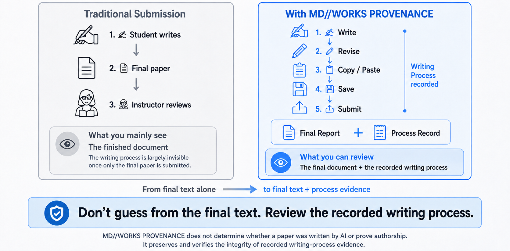
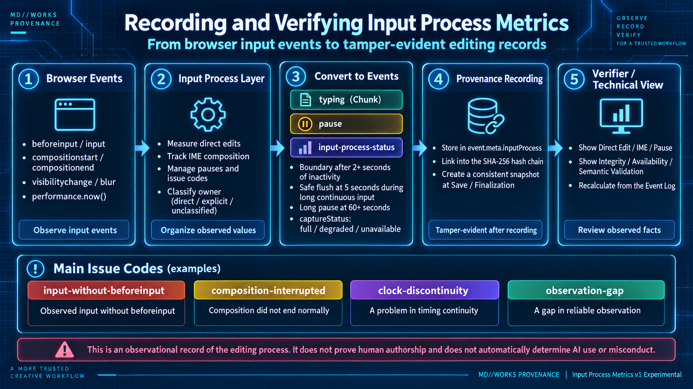
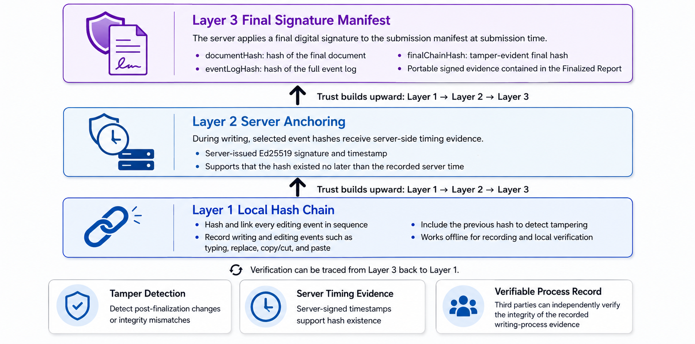

# MD//WORKS PROVENANCE
**Documentation:** [🇺🇸 English](README.md) | [🇯🇵 日本語](README-ja.md) <br>

**Don’t guess whether a paper was written by AI. Preserve how it was written.**

[](./LICENSE)
[](#beta-status)
[](#privacy-and-trust-boundaries)
[](#privacy-and-trust-boundaries)

As generative AI, copy-and-paste workflows, and Word-based drafting become routine, it is increasingly difficult to infer how a document was produced from the final text alone.

MD//WORKS PROVENANCE takes a different approach. Instead of trying to classify text as “human” or “AI,” it **records the writing process and makes later changes to the protected record detectable.**

<br>

> ### 💡 MD//WORKS PROVENANCE in 1 minute
>
> **What is it?**  
> A Markdown editor that records the **Writing Process** — how a document was edited —
> instead of trying to guess whether AI was used.
>
> **What does it preserve?**  
> - Direct editing activity, Paste provenance, writing Sessions, interaction-active time, and other process evidence are stored in a self-contained HTML Report.
> - At submission, a server-issued Final Signature can be added so that later inconsistencies with the signed record can be detected.
>
> **Who makes the judgment?**  
> MD//WORKS PROVENANCE **does not automatically decide whether AI was used**, who authored the text, whether plagiarism occurred, or whether misconduct took place. It provides transparent process evidence for educators, supervisors, reviewers, and writers to interpret in context. Writers can also use it to preserve a process record they can later explain and share when needed

[Try it instantly](https://hkjpn.github.io/MD-WORKS-PROVENANCE/) · [See tamper detection in action](https://github.com/HKJPN/MD-WORKS-PROVENANCE/blob/main/samples/README.md)  · [Documentation](./Manual.md) · [Student FAQ](./FAQ.md)　 ·  

---

## 👨‍🎓 For Writers & Students

Write your text as usual and use **Save Report** to save an HTML Report that includes your writing process record. Copy/Cut and Paste actions within the same Report are matched and recorded as **Verified Internal**. Any Paste that cannot be traced back to the same Report is marked as **Unverified**.

Of course, an **Unverified** paste simply means:

> **Unverified ≠ External Source ≠ AI ≠ Plagiarism ≠ Misconduct**

However, it is highly recommended to keep the proportion of external pastes low and do most of your drafting and editing directly within MD//WORKS PROVENANCE. If your Report contains a high volume of external pastes, it will be clearly visible to evaluators, [as shown in our second sample file](https://github.com/HKJPN/MD-WORKS-PROVENANCE/blob/main/samples/README.md?utm_source=gemini).

As an experimental feature, the editor also records **Input Process Metrics**—such as Direct Edits, deletions, IME Compositions, Typing Chunks, and Pauses. The purpose of these metrics is to capture your unique typing behavior, helping to distinguish human writing from AI generation or automated input tools.

When you are ready to submit, select **File > Submit Report** to generate a local **Finalized Report** sealed with a Final Signature. You will then submit this file to your evaluator using their specified method.

While you can write and record your process offline in MD//WORKS PROVENANCE, **an internet connection is required when clicking "Submit Report."** This is because the application must request a tamper-evident digital signature (Final Signature) from the server to seal your final record. If the writing process or final document is tampered with, or if the file becomes corrupted, the verifier will flag it—[as demonstrated in our third sample file](https://github.com/HKJPN/MD-WORKS-PROVENANCE/blob/main/samples/README.md?utm_source=gemini).

Through this architecture, your Writing Process is not "surveilled." Instead, you are preserving your own verifiable evidence, allowing you to **explain and prove your writing process whenever necessary**.

| [Student FAQ](./FAQ.md) | [Practical Recommendations](https://github.com/HKJPN/MD-WORKS-PROVENANCE/blob/main/Manual.md#29-practical-recommendations)

---

## 👨‍🏫 For Evaluators & Instructors

Submitted Reports can be verified **locally entirely within your browser—no need to upload student files to third-party verification servers.**

**To inspect a single Report in detail:**

→ Use the **Report Verifier**

**To review a batch of Reports for an entire class:**

→ Use the **Overview Verifier**

The Verifier allows you to inspect the Document Hash, Event Log, Event Chain, Final Signature, Paste Provenance, Writing Timeline, Input Process Metrics, and more.

To understand what these metrics mean and how to evaluate tampering or potential misconduct, please refer to our [three evaluation sample files](https://github.com/HKJPN/MD-WORKS-PROVENANCE/blob/main/samples/README.md).

*Note: In the current beta, automatic classification for `Review Priority` is not enabled, and will typically display as **Not assessed**.*

[Practical Recommendations](https://github.com/HKJPN/MD-WORKS-PROVENANCE/blob/main/Manual.md#29-practical-recommendations) |  [Read the whole Manual](./Manual.md)

---

### Roadmap

**Level 0 — Current Beta**

* Provides Writing Process recording, Paste PROVENANCE, Input Process Metrics (Experimental), Working / Finalized Reports, Report Verifier, and Overview Verifier.
* No identity verification is provided. The management of student information relies on the rules and workflows of individual courses (e.g., requiring the student ID in the filename).

**Level 1**

* Add official fields for `studentId`, `studentName`, and `studentEmail` to the Manifest via a new **File > Report Info** menu.

**Level 2**

* Institutional SSO (OIDC) integration.
* Addition of an Email Verification column.

*The following sections contain slightly more technical information intended for computer science professionals, institutions, and enterprises considering deployment.*
---

## ⚙️ Core Concept: PROVENANCE, not prediction

Many academic-integrity tools primarily examine the final submission. MD//WORKS PROVENANCE focuses on a different question:

> **What Writing Process was recorded, and does that record still match the evidence that was saved and signed?**

Rather than predicting “human” or “AI” from the final text,
MD//WORKS PROVENANCE preserves observable process evidence and makes the integrity of that record independently verifiable. That is the core idea behind MD//WORKS PROVENANCE.

---

## Why this exists

Generative AI changed the question.

For years, academic-integrity tools mostly examined the **final submission**:

- Does it resemble published material?
- Does it statistically resemble AI-generated text?
- Does it match another student's work?

Those questions can still be useful.

But they do not answer a different question:

> **What writing process was actually recorded before this document was submitted?**

MD//WORKS PROVENANCE focuses on that missing layer.

It does not claim to prove who physically typed every sentence.

It does not try to classify prose as human or AI.

Instead, it preserves a structured process record and makes later modification detectable.

That makes it useful not only for academic integrity, but also for:

- formative assessment
- writing-process research
- transparent AI-use policies
- supervised coursework
- research training
- reflective writing practice
- independent authors who want to preserve process evidence they can later share

---

## How it works

```text
Student
  │
  │ write / revise / copy / paste
  ▼
MD//WORKS PROVENANCE Editor
  │
  ├─ Writing Events
  ├─ Input Process Metrics
  │    ├─ Direct Edit / Deletion
  │    ├─ IME Composition
  │    ├─ Typing Chunks / Pauses
  │    └─ Capture Status / Issue Codes
  ├─ Paste PROVENANCE
  ├─ Sessions / Active Time
  ├─ Event Hash Chain
  └─ Server Anchors
  │
  │ Save Report
  ▼
Working Report (.html)
  │
  │ Submit Report
  │ Final Signature
  ▼
Finalized Report (.html)
  │
  ├──────────────────────┐
  ▼                      ▼
Report Verifier          Overview Verifier
(one Report)             (many Reports)
  │                      │
  └──── local browser verification
````

The ordinary writing workflow remains simple:

1. Open the Editor.
2. Write.
3. Save a Working Report.
4. Submit when ready.
5. Verify the Finalized Report.

---

## The core idea: PROVENANCE, not prediction

MD//WORKS PROVENANCE is built around **observable PROVENANCE**.

### Verified Internal Paste

If text is copied or cut inside the same Report and later pasted back into that Report, MD//WORKS PROVENANCE can attempt to verify that transfer using recorded PROVENANCE metadata.

A successful match is recorded as:

```text
Verified Internal
```

### Unverified Paste

If a Paste cannot be matched to a previous Copy/Cut in the same Report, it is recorded as:

```text
Unverified
```

This may include text pasted from:

* a website
* a PDF
* Microsoft Word
* another MD//WORKS PROVENANCE Report
* a note-taking app
* a generative AI tool
* a clipboard where PROVENANCE metadata was lost

So:

> **Unverified does not mean external.**
> **Unverified does not mean AI.**
> **Unverified does not mean plagiarism.**
> **Unverified does not mean misconduct.**

It means only that the Paste could not be verified as a prior Copy/Cut from the same Report.

---

## What can be verified — and what cannot

| MD//WORKS PROVENANCE can verify               | MD//WORKS PROVENANCE does not prove                          |
| --------------------------------------------- | ------------------------------------------------------------ |
| Document Hash consistency                     | Who physically authored the text                             |
| Event Log Hash consistency                    | Whether AI was used                                          |
| Event Hash Chain continuity                   | Whether Unverified text came from an external source         |
| Final Chain Hash consistency                  | Whether a student followed course policy                     |
| Recorded Sessions and interaction-active time | Total thinking, reading, or research time                    |
| Same-Report Copy/Cut → Paste matches          | Plagiarism or misconduct                                     |
| Input Process Event integrity                 | Whether an input event was produced by a human or automation |
| Input Process capture availability            | Human authorship or academic compliance                      |
| Server Anchor signatures                      | Exact writing time                                           |
| Final Signature validity                      | Student identity                                             |

This distinction is intentional.

---

## Input Process Metrics — observing how edits happen

> **Experimental**
>
> Input Process Metrics extend the Writing Process record with lightweight observations about how text was entered and edited.
>
> They are not an AI detector and are not used to automatically classify a writer as human, automated, suspicious, or compliant.

Modern automation can enter generated text through normal-looking editing operations instead of using Paste.

For example, software may:

* enter text incrementally
* introduce delays
* simulate deletion and revision
* interact with the Editor through browser or operating-system automation

MD//WORKS PROVENANCE does not attempt to identify the actor behind those events.

Instead, it records a richer description of the editing process that the Editor actually observed.

> **The goal is not to decide who or what produced an input event. The goal is to preserve more of what the Editor actually observed.**

### What is recorded

Input Process Metrics can include:

* **Direct Edit**
  Characters directly inserted or removed in the Editor

* **Deletion Operations**
  Direct editing operations that removed text

* **IME Composition**
  Browser-observed composition sessions, committed text, and measurable composition duration

* **Typing Chunks**
  Groups of directly observed edits separated by defined recording boundaries

* **Pauses**
  Intervals in which no qualifying editing activity was observed

* **Capture Status**
  Whether the relevant process data was fully available, degraded, or unavailable

* **Issue Codes**
  Technical notes describing incomplete or uncertain observation

The additional process data is stored with the event record and becomes part of the same tamper-evident Event Hash Chain.

<br>

### Chunk and Pause model

The current experimental implementation uses:

* **2 seconds of inactivity** as the threshold for a Chunk boundary and Pause observation
* **5 seconds** as a safe flush limit during long continuous input — this is not a Pause
* **60 seconds** as the threshold for classifying an observed Pause as a `long pause`

These thresholds describe **recording behavior**.

They are not psychological, behavioral, or academic-integrity thresholds.

A Pause does not mean that the writer was:

* thinking
* reading
* researching
* consulting another source
* away from the keyboard

Likewise, a deletion does not mean that the writer made a mistake.

### IME-aware recording

IME-based writing requires special handling because browsers may expose multiple intermediate composition states before text is committed.

MD//WORKS PROVENANCE therefore distinguishes:

```text
compositionstart
→ intermediate composition activity
→ compositionend
→ committed document change
```

Intermediate IME text is not treated as a sequence of separately typed characters.

The Report does not intentionally preserve uncommitted IME composition text.

The recorded metrics describe browser-observed composition behavior rather than the writer's intent.

### Capture quality is recorded, not guessed

Browser, operating-system, IME, accessibility, and input-method behavior can vary.

If a measurement cannot be obtained reliably, MD//WORKS PROVENANCE does not silently replace it with a plausible value.

For example:

```text
0
```

means that the metric was observable and the observed value was zero.

```text
null
```

means that the metric applies, but could not be measured reliably.

A missing Input Process field may indicate an older Report created before that metric existed.

Capture status may therefore be recorded as:

```text
full
degraded
unavailable
```

### Issue Codes

Technical Issue Codes describe conditions that affected observation or measurement.

Examples include:

```text
input-without-beforeinput
composition-interrupted
clock-discontinuity
observation-gap
```

These are **capture-quality observations**, not misconduct indicators.

For example:

```text
input-without-beforeinput
```

means that an `input` event was observed without a matching `beforeinput`.

It does **not** mean that synthetic input, automation, or AI use was detected.

Likewise:

```text
clock-discontinuity
```

indicates a timing-continuity problem.

It does not mean that the Report was tampered with.

And:

```text
observation-gap
```

means that part of the process could not be observed reliably.

It is not equivalent to a long Pause and is not evidence of AI use.

### Verification, not classification

The Verifier can independently recompute Input Process summaries from the Event Log and distinguish between:

```text
Integrity
Input Process Availability
Semantic Validation
Summary Consistency
```

These are separate concepts.

A Report may therefore legitimately show:

```text
Integrity: Verified
Input Process: Partial
```

This means that the recorded event history is cryptographically consistent while some Input Process information was unavailable or incomplete.

It does not mean that the Report is suspicious.

Similarly:

```text
Integrity: Verified
Semantic Validation: Invalid
```

may indicate that an event is cryptographically intact but contains a value that is not valid under the supported Input Process schema.

Integrity and semantic validity are deliberately evaluated separately.

### Important limitation

> **Input Process Metrics describe observable editing activity.**
>
> They do not prove human authorship, identify the input source, determine AI use, or establish academic misconduct.

Input Process Metrics are currently exposed as **Experimental** evidence in the Technical View.

They are not converted into:

* Human scores
* AI scores
* authenticity scores
* suspicion scores
* automatic misconduct flags

For detailed recording rules, fallback behavior, semantic validation, and acceptance tests, see:

[Input Process Metrics Specification](./Input_Process_Metrics_v2.1.2.md)

---

## Student-facing Editor

### Writing Record

A compact status view shows the current process record while the student writes:

```text
Active 24m | Unverified 22% | [Input activity] | Anchors: 14
```

The detailed **Current Writing Record** includes:

* interaction-active time
* sessions
* current document size
* direct input
* Verified Internal Paste
* Unverified Paste
* non-internal paste share
* event count
* server anchor count

These are descriptive process indicators, not a misconduct score.

### Input Process Metrics

The Editor experimentally records lightweight Input Process Metrics for:

* Direct Edit
* deletion activity
* IME composition
* typing chunks
* pauses
* capture status

It does not intentionally store:

* a raw per-keystroke timing sequence
* IME intermediate / uncommitted composition text

These metrics describe observed editing activity and are not converted into an AI, human-authorship, or misconduct score.

### Save and resume

A Working Report is saved as a self-contained HTML file containing:

* the current Markdown document
* recorded writing events
* Input Process Metrics where available
* session information
* summary data
* integrity metadata

The student can reopen the Report later and continue in a new Session.

A new Session does not treat the time between closing and reopening the Report as an observed Pause.

### Word import

`.docx` files can be converted locally and inserted at the current cursor position.

Because MD//WORKS PROVENANCE did not observe how the Word document itself was created, imported text is recorded as:

```text
PROVENANCE = unverified
inputSource = word-import
```

### Submit and finalize

Submission is deliberately separate from ordinary Save.

```text
Save Report
→ Working Report

Submit Report
→ Ready to Submit
→ Sign & Finalize
→ Finalized Report
```

The Finalized Report receives a server-issued Ed25519 signature over its final Manifest.

Save and Finalization also establish consistent document / Event Log snapshots so that the document state and the corresponding process record are evaluated together.

### Emergency Recovery

Emergency Recovery keeps a single temporary text snapshot in the browser session.

It is designed for **text salvage only**.

It is not:

* a backup system
* a Writing Process restore system
* a replacement for Save Report
* an Academic Report

### Print Preview

Print/PDF output is intended for reading, proofreading, and review.

It is **not** the cryptographically verifiable Academic Report submission format.

---

## Verification for individuals and institutions

MD//WORKS PROVENANCE provides two verification workflows built around the same integrity model.

### Report Verifier — one Report

The **Report Verifier** is designed for a single Academic Report.

It is useful not only for instructors, but also for individuals who want to keep a verifiable record of their own writing process and later explain it to a third party.

Typical use cases include:

* a student sharing a thesis-writing record with a supervisor
* a researcher documenting how a manuscript developed
* an author or freelance writer showing process evidence to an editor or client
* collaborators reviewing the PROVENANCE of a shared draft
* anyone who wants to preserve a portable, independently verifiable writing record

The Report Verifier independently checks:

* Document Hash
* Event Log Hash
* Event Hash Chain
* Final Chain Hash
* Summary consistency
* Server Anchor signatures
* Final Signature
* Input Process semantic validity where supported

It also provides detailed Teacher View / Technical View information.

### Overview Verifier — many Reports

The **Overview Verifier** is designed for classes, institutions, and other workflows involving multiple Reports.

Multiple Reports can be loaded together for first-pass review.

Typical columns include:

* Student / file label
* Active time
* Sessions
* Non-internal paste share
* Process status
* Integrity
* Signature
* Review

A Report selected from the Overview can then be examined in the same detailed views used for single-Report verification.

This is useful for classes where instructors need to review tens or hundreds of submissions without opening each file separately.

### Same evidence model, different workflow

The distinction is primarily about workflow:

```text
One Report
→ Report Verifier
→ explain / inspect / share the process record

Many Reports
→ Overview Verifier
→ screen the class or collection
→ inspect selected Reports in detail
```

The Report Verifier is therefore not a reduced version of the Overview Verifier.

It is the simpler, single-Report interface for personal, research, editorial, and third-party review.

### Teacher View

The Teacher View focuses on higher-level review:

* verification status
* writing-process summary
* session-based timeline
* final document

Input Process Metrics are currently Experimental and are not converted into Human / AI / Suspicious classifications in the Teacher View.

### Technical View

The Technical View exposes the underlying evidence:

* hashes and chain status
* anchors and signature status
* session metadata
* Input Process schema and capture status
* Direct Edit / IME / Pause summaries
* Issue Codes
* Input Process Availability
* Semantic Validation
* Summary consistency
* event details

Input Process values are recomputed from the Event Log where possible rather than treated as an authorship score.

A large number of:

* pauses
* deletions
* IME compositions
* chunks
* other process events

is not automatically highlighted as suspicious.

The goal is transparency: the process record should remain understandable to writers, educators, reviewers, and technical auditors.

---

## Tamper-evident, not tamper-proof

MD//WORKS PROVENANCE Reports are ordinary HTML files.

They can be edited.

What matters is that unauthorized changes become detectable.

Conceptually:

```text
Document
   │
   └─ SHA-256
      └─ Document Hash

Events
   │
   ├─ previousHash
   └─ SHA-256
      └─ Event Hash Chain

Final state
   │
   └─ Manifest
      │
      └─ Ed25519
         └─ Final Signature
```

Input Process Metrics stored inside Events are covered by the same Event Hash Chain.

If the document is changed, the Document Hash no longer matches.

If an event — including its Input Process data — is changed, the Event Hash Chain no longer matches.

If the signed Manifest is changed, the Final Signature no longer verifies.

This is why MD//WORKS PROVENANCE describes its evidence as **tamper-evident** rather than immutable.

Cryptographic integrity does not prove that the recorded event was produced by a human.

It proves that the recorded data still matches the protected record.

---

## Server Anchor vs Final Signature

They serve different purposes.

### Server Anchor

During writing, the application can submit selected event-hash information to a server.

The server returns a signed anchor with server time.

A valid anchor can support the statement:

> This anchored hash had reached the server no later than this server timestamp.

It does **not** prove:

* the exact moment the text was written
* who wrote it
* that the document was complete at that time

### Final Signature

At submission, the final Manifest is signed with Ed25519.

This lets the Verifier determine whether the finalized Manifest still matches what was signed.

<br>

---

## Privacy and trust boundaries

MD//WORKS PROVENANCE is designed to record the writing process without turning the Editor into a surveillance client.

### Not stored in the Academic Report

The Report does not intentionally store:

* IP addresses
* raw User-Agent strings
* hardware identifiers
* precise geolocation
* screen resolution
* per-keystroke keylogging
* raw per-keystroke timing sequences
* IME intermediate / uncommitted composition text
* local filesystem paths
* File System Access handles
* Emergency Recovery text

Input Process Metrics use aggregated process observations rather than a raw keystroke timeline.

Editor/environment information is stored only as **coarse PROVENANCE metadata** such as platform and browser family.

That metadata is evidence recorded by the application — it is **not runtime attestation**.

### Trust boundary of browser-observed events

MD//WORKS PROVENANCE records what the Editor observed.

It does not authenticate the physical source of each browser event.

For example, an event may ultimately originate from:

* a physical keyboard
* an IME
* speech input
* accessibility software
* predictive text
* browser automation
* operating-system automation

The Input Process record does not claim to distinguish these sources unless the browser itself exposes reliable information that the specification explicitly records.

### Modified clients

A valid Hash Chain means that the protected record has not been altered after it was sealed.

It does not guarantee that a modified Editor generated truthful metrics before sealing them.

The trust model therefore distinguishes between:

* integrity of the recorded data
* authenticity of the recording implementation
* identity of the person or system producing input

These are different questions.

### Network communication

Normal editing, Preview, local Save, Word Import, Print Preview, and verification can operate locally.

Network communication is used for:

* Server Anchors
* Final Signature requests

The Verifier does not need to upload a student's full Report to a remote verification service.

A separate operational note: not storing IP addresses in the Report does not mean that normal web infrastructure is technically incapable of seeing network metadata.

Server and hosting logs should be governed separately by the institution's deployment policy.

---

## Interface language

The Editor, Report Verifier, and Overview Verifier automatically use Japanese or English based on the browser's preferred languages.

The current beta does not provide an in-app language selector.

Interface language changes presentation only. It does not change Report evidence, hashes, signatures, integrity decisions, sorting semantics, or verification outcomes.

---

## Quick start

### 1. Open the Editor

```text
academic-editor.html
```

Beta recommendation:

```text
Windows + current Chrome / Edge
```

### 2. Write and save

```text
Ctrl+S
→ Save Report
→ Working Report (.html)
```

### 3. Submit

```text
Submit Report
→ Ready to Submit
→ citation/source check
→ Sign & Finalize
→ Finalized Report (.html)
```

Submission requires a network connection.

### 4. Verify

For a single Report, open:

```text
report-verifier.html
```

For a class or collection of Reports, open:

```text
overview-verifier.html
```

and load the Finalized Report(s).

---

## Where it fits

MD//WORKS PROVENANCE is not intended to replace similarity checking, AI-policy enforcement, or an LMS.

It addresses a different layer.

| Approach                  | Primary focus                                      | What MD//WORKS PROVENANCE adds                                                                     |
| ------------------------- | -------------------------------------------------- | -------------------------------------------------------------------------------------------------- |
| Similarity checker        | Similarity between final text and existing sources | Writing-process evidence                                                                           |
| AI classifier             | Statistical characteristics of the final text      | No AI probability; observable process PROVENANCE instead                                           |
| Cloud revision history    | Editing history inside one cloud platform          | Portable evidence inside the submitted Report                                                      |
| LMS submission            | Identity / course workflow / file collection       | Cryptographic integrity of the process record                                                      |
| Input-process observation | Browser-observed editing behavior                  | Lightweight Direct Edit / IME / Chunk / Pause evidence without automatic authorship classification |
| **MD//WORKS PROVENANCE**  | **Recorded Writing Process**                       | **Portable PROVENANCE + hash-chain + signature verification for one Report or many Reports**       |

These systems can be complementary.

---

## A practical example

Suppose a 3,000-word report contains:

* several hours of recorded interaction-active writing
* multiple sessions over several days
* Direct Edit and revision activity
* browser-observed IME composition
* multiple Typing Chunks and Pauses
* several Verified Internal moves
* a 250-character Unverified Paste
* valid Event Chain
* valid Final Signature
* complete Input Process capture

MD//WORKS PROVENANCE does **not** conclude:

> “This paper is authentic.”

It does not conclude:

> “This was written by a human.”

And it does not conclude:

> “No AI was used.”

Instead, it gives the reviewer a more precise statement:

> “This Report contains a consistent, cryptographically verifiable record of these observed writing events and Input Process observations, including one Paste that could not be matched to a prior Copy/Cut in the same Report.”

If some Input Process information could not be measured, the Report may instead show:

```text
Integrity: Verified
Input Process: Partial
```

without treating that condition as misconduct.

That difference matters.

---

## Beta status

MD//WORKS PROVENANCE is currently in beta and is being tested in real writing workflows.

### Recommended environment

* Windows
* current Chrome / Edge

Other browsers may use fallback file-download behavior where File System Access APIs are unavailable.

Input Process Metrics are currently **Experimental** and are undergoing additional browser / IME validation.

### Known limitations

* browser and OS differences can affect native file pickers, IME behavior, and printing
* Input Process Metrics may be partially unavailable depending on browser, OS, IME, and input method
* capture-quality differences are reported as `degraded` / `unavailable` rather than treated as evidence of misconduct
* some browser-event sequences may require fallback observation rather than full Input Process measurement
* Word table text is preserved, but conversion to Markdown pipe-table structure is not guaranteed
* extremely large documents with tens of thousands of Find matches can make highlight rendering slow
* Emergency Recovery is not a formal backup
* Print/PDF is not the Academic Report submission format
* the current beta does not provide identity verification
* Input Process Metrics do not authenticate whether events came from a physical keyboard, automation, speech input, accessibility software, or another input source

---

## License

### Academic edition

Unless otherwise noted, the MD//WORKS PROVENANCE code in this repository is licensed under:

**GNU Affero General Public License v3.0 only (`AGPL-3.0-only`)**

See [`LICENSE`](./LICENSE) for the legally controlling terms.

> **AGPL does not prohibit commercial use.**
> Commercial use, modification, and redistribution are permitted subject to the license terms.

### Why AGPL?

In MD//WORKS PROVENANCE, the verification logic is part of the academic trust model.

If an institution modifies the software, the important question should not become:

> “What does the hidden version of the verifier really do?”

AGPL helps keep network-deployed modifications auditable by requiring source availability in the circumstances covered by the license.

The intent is simple:

> **If the process-evidence logic changes, the people relying on it should be able to inspect that logic.**

This applies especially to components such as:

* Event recording
* Paste PROVENANCE
* Input Process Metrics
* Hash Chain verification
* Semantic Validation
* signature verification

The `LICENSE` file, not this README, controls the exact legal obligations.

### Standard MD//WORKS

The standard MD//WORKS project is separate and remains subject to its own MIT license.

Publishing the Academic edition under AGPL does not revoke or alter rights already granted under MIT for the standard edition.

### Third-party software

MD//WORKS PROVENANCE may bundle third-party libraries.

Those components remain subject to their own licenses and notices.

Do not remove their copyright or license notices.

---

## What about student papers?

Students retain the copyright and other rights they hold in their own writing.

The AGPL license on MD//WORKS PROVENANCE does not transfer ownership of a student's essay, paper, thesis text, or research writing to the software author.

However, an Academic Report is a self-contained HTML container and may contain both:

1. user-authored content, and
2. AGPL-covered application code.

Those are different layers inside the same file.

When redistributing the Report container, do not remove license notices applicable to the software code or bundled third-party components.

---

## AGPL and network use

AGPL-3.0 Section 13 addresses modified versions of the Program that support remote interaction over a network.

Where that provision applies, users interacting with the modified version must be offered an opportunity to receive the corresponding source of that version.

Distribution of modified copies can also trigger the AGPL's ordinary source-code obligations.

If MD//WORKS PROVENANCE is deployed through an LMS or institutional web service, provide a clear **Source / License** path in the user interface and follow the `LICENSE` terms for the actual deployment model.

---

## Institutional License

For code for which the MD//WORKS PROVENANCE copyright holder owns the necessary rights, an alternative **Institutional License** may be offered.

This is not a “commercial-use license” — AGPL already permits commercial use.

An Institutional License is intended for organizations that need terms such as:

* proprietary modifications
* closed-source integration
* private institutional deployment
* LMS / SSO / grade-system integration
* deployment assistance
* support
* SLA

Third-party dependencies remain governed by their original licenses.

---

## Contributions

To preserve the possibility of both AGPL and alternative institutional licensing, contribution rights need to be clear.

During the beta period:

* bug reports are welcome
* design feedback is welcome
* validation results are welcome
* feature proposals are welcome

Before broadly accepting external code contributions, the project may publish a Contributor License Agreement (CLA) or equivalent contribution policy.

---

## Security and academic-integrity disclosure

MD//WORKS PROVENANCE does not guarantee:

* prevention of all cheating
* proof of authorship
* proof of identity
* detection of all AI use
* detection of plagiarism
* detection of automation
* perfect reconstruction of every human action
* complete Input Process capture in every browser or input environment

It is a system for preserving and verifying a **recorded writing process**.

Input Process Metrics extend the amount of observable process evidence that can be preserved, but they do not change that fundamental trust boundary.

If you discover a security issue, signature-verification flaw, PROVENANCE bypass, Input Process recording flaw, or evidence-semantics problem, please use the repository's designated security contact rather than publishing detailed exploit instructions in a public Issue.

---

## Design principle

MD//WORKS PROVENANCE is built around one idea:

> **Stop guessing from the final text. Preserve the process evidence.**

Not:

> “Was this written by AI?”

But:

> “What writing process was recorded, and can we verify that the record has not been altered?”

Input Process Metrics extend that principle one step further:

> **Preserve not only that editing occurred, but more of how the Editor observed it occurring — without turning observation into automatic judgment.**

That is the problem MD//WORKS PROVENANCE is trying to solve.

